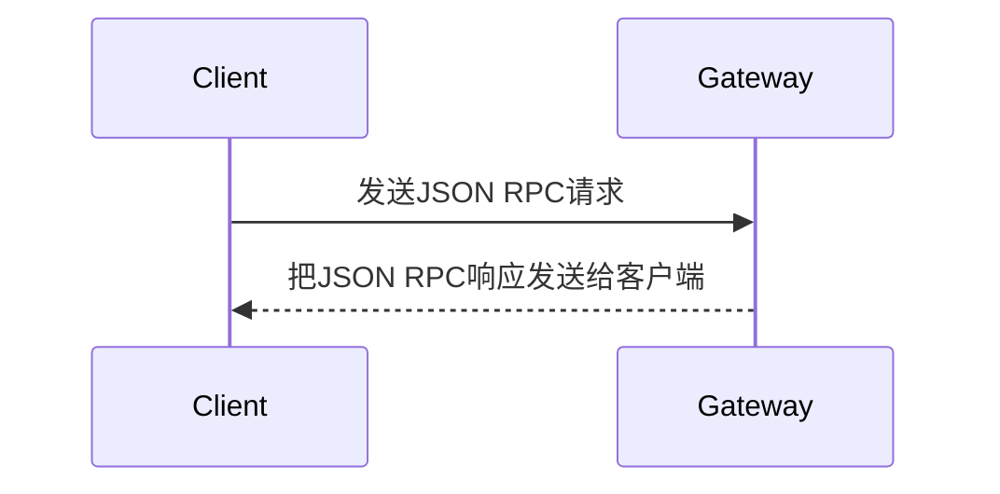

# Markdown特殊用法

* 收录一些不太常见的markdown用法

## 内嵌SVG

> 时间：2024年3月22日10:54:00

可以在Markdown文件内直接使用SVG标签。这是一个例子：

<svg height="100" width="100">
 <circle cx="50" cy="50" r="40" stroke="black" stroke-width="3" fill="red" />
</svg>

* 这将在md文件渲染时显示一个红色的圆圈。
* 但是并非所有Markdown渲染器都会执行此操作。
* 例如，GitHub的Markdown渲染器由于安全原因不允许内嵌的SVG和其他HTML标记。

## mermaid流程图

> 2025-07-31 09:25:48

[Markdown如何画时序图-CSDN博客](https://blog.csdn.net/zhw21w/article/details/125749449)

