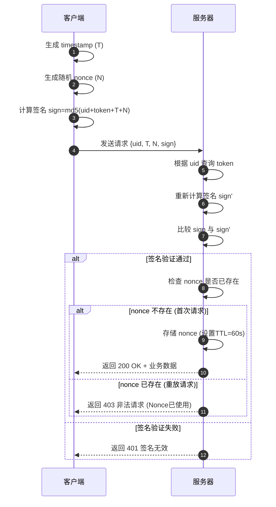
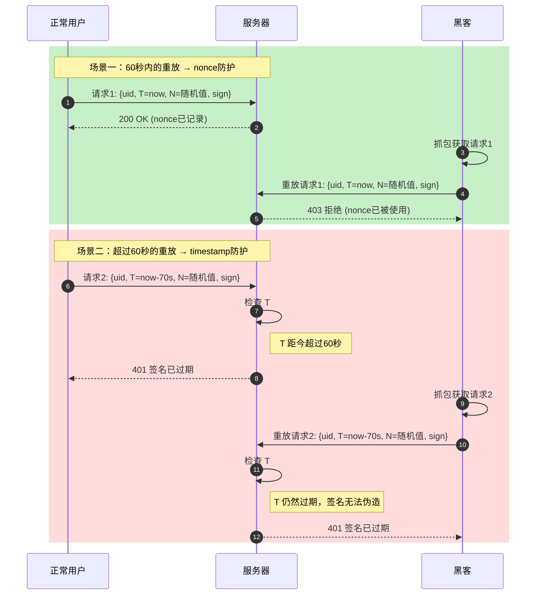
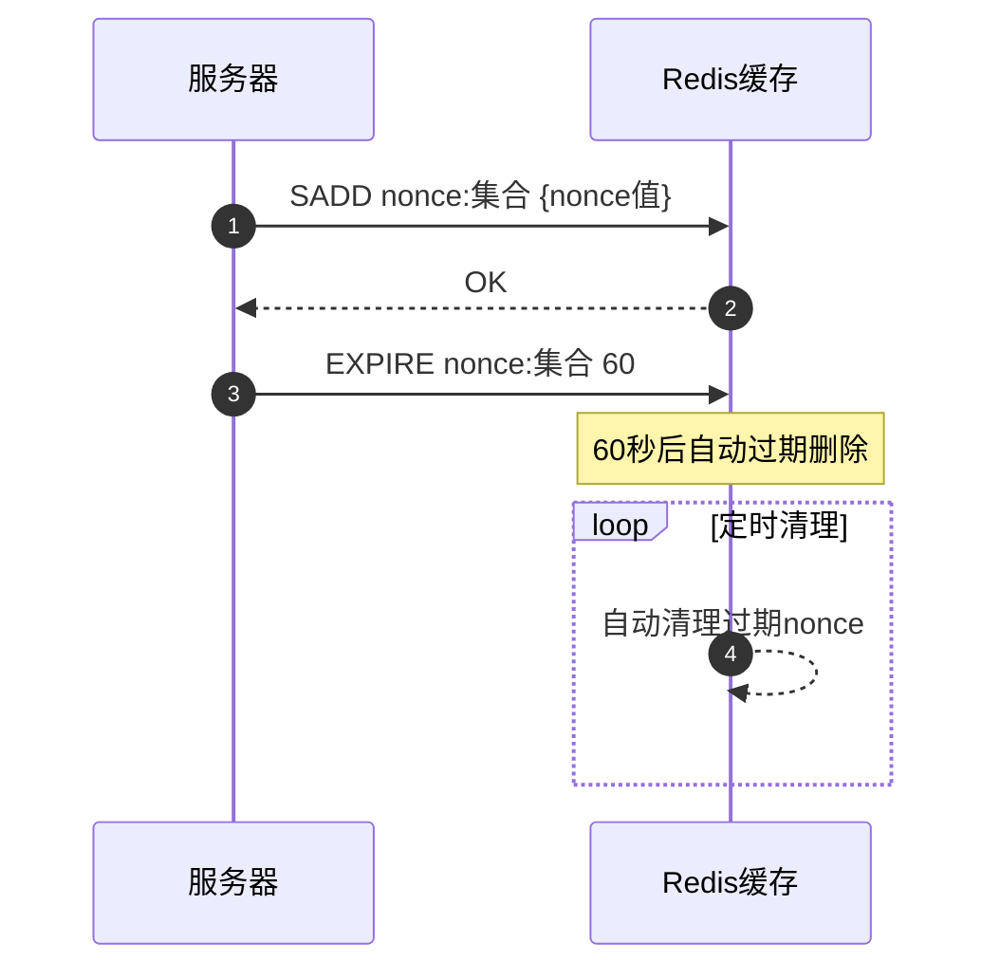

# 基于timestamp和nonce的防重放方案

[基于timestamp和nonce的防止重放攻击方案_timestamp+nonce-CSDN博客](https://blog.csdn.net/koastal/article/details/53456696)

## 一、背景

> 重放攻击是计算机世界黑客常用的攻击方式之一，所谓重放攻击就是攻击者发送一个目的主机已接收过的包，来达到欺骗系统的目的，主要用于身份认证过程。

首先要明确一个事情，重放攻击是二次请求，黑客通过抓包获取到了请求的HTTP报文，然后黑客自己编写了一个类似的HTTP请求，发送给服务器。也就是说服务器处理了两个请求，先处理了正常的HTTP请求，然后又处理了黑客发送的篡改过的HTTP请求。

## 二、方案

那我们如果同时使用timestamp和nonce参数呢？
nonce的一次性可以解决timestamp参数60s的问题，timestamp可以解决nonce参数“集合”越来越大的问题。

我们在timestamp方案的基础上，加上nonce参数，因为timstamp参数对于超过60s的请求，都认为非法请求，所以我们只需要存储60s的nonce参数的“集合”即可。

假如黑客通过抓包得到了我们的请求url

其中

```text
$sign=md5($uid.$token.$stime.$nonce);
// 服务器通过uid从数据库中可读出token
```

如果在60s内，重放该HTTP请求，因为nonce参数已经在首次请求的时候被记录在服务器的nonce参数“集合”中，所以会被判断为非法请求。超过60s之后，stime参数就会失效，此时因为黑客不清楚token的值，所以无法重新生成签名。

综上，我们认为一次正常的HTTP请求发送不会超过60s，在60s之内的重放攻击可以由nonce参数保证，超过60s的重放攻击可以由stime参数保证。

因为nonce参数只会在60s之内起作用，所以只需要保存60s之内的nonce参数即可。

## 三、时序图

### 1. 正常请求流程



### 2. 防重放攻击时序



### 3. nonce存储策略



### 关键参数说明

| 参数 | 说明 | 作用 |
|------|------|------|
| `timestamp` | 请求发起时间戳 | 防止超过60秒的旧请求重放 |
| `nonce` | 随机字符串(如UUID) | 防止60秒内的请求重放 |
| `sign` | 签名 `md5(uid+token+timestamp+nonce)` | 防止请求被篡改 |

### 防御时间窗口

| 时间范围 | 防护机制 | 说明 |
|----------|----------|------|
| 0~60秒 | nonce检查 | 同一nonce不可重复使用 |
| >60秒 | timestamp检查 | 请求自动失效 |

> **安全提示**：nonce集合建议使用Redis的SET数据结构，设置TTL自动过期，避免存储膨胀。