# 关于AOP编程

> * SpringAOP本质是代理模式
> * AOP核心概念有两个:目标对象和代理

## AOP概念

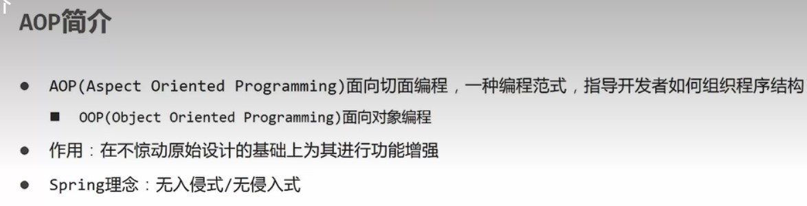
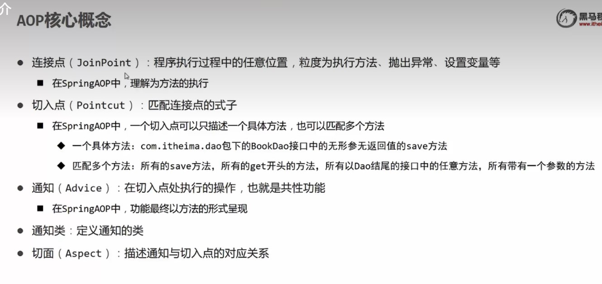
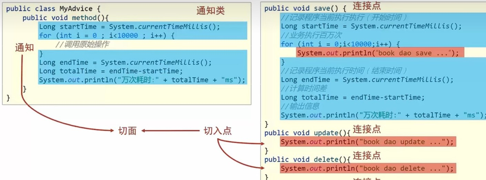
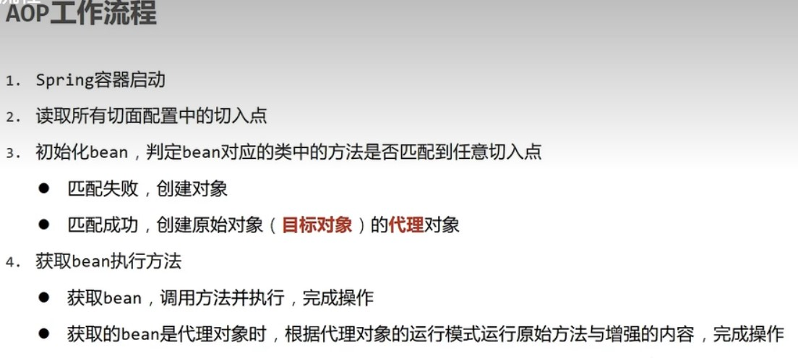

## 上手

* 先在pom.xml导入坐标

```html

<dependency>
    <groupId>org.aspectj</groupId>
    <artifactId>aspectjweaver</artifactId>
    <version>1.9.9.1</version>
</dependency>
```

* 再定义一个接口和它的实现类
* 这个两个类很正常，毕竟AOP主打的就是无侵入式
* AOPTest.java

```java
public interface AOPTest {
    void firstMethod();

    void secondMethod();

    void thirdMethod();
}
```

* AOPTestImpl.java

```java

@Component
public class AOPTestImpl implements AOPTest {
    @Override
    public void firstMethod() {
        System.out.println("这是第一个方法");
    }

    @Override
    public void secondMethod() {
        System.out.println("This is a second method");
    }

    @Override
    public void thirdMethod() {
        System.out.println("第三个方法");
    }
}
```

* 再定义一个通知类，用于实现AOP
* Component声明bean,Aspect声明这是一个通知类
* Pointcut写所实现方法的全路径，下面跟一个private的空方法
* Before表示在切入方法之前执行,也可以用其他注解，比如Around表示把切入方法放在通知方法里面
* MyAdvice.java

```java

@Component
@Aspect
public class MyAdvice {
    @Pointcut("execution(void testAOP.AOPTest.firstMethod())")
    private void needMethod() {
    }

    @Before("needMethod()")
    public void adviceMethod() {
        System.out.println("这是切片");
        System.out.println(System.currentTimeMillis());
    }
}
```

* 接着在配置类中进行导入
* 注意:新增了注解`@EnableAspectJAutoProxy`
* 作用是向spring声明所扫描的bean中存在通知类
* 其他的都是上一个实验的

```java

@Configuration
@ComponentScan({"service", "dao", "testAOP"})
@EnableAspectJAutoProxy
@PropertySource("classpath:jdbc.properties")
@Import({JdbcConfig.class, MybatisConfig.class})
public class SpringConfig {
}
```

# 关于around的注解

* 把配置类这样改就行，完全就是大改
* 因为这位注解有严格的格式
* 这个格式给其他的注解通用

```java

@Component
@Aspect
public class MyAdvice {
    @Pointcut("execution(void testAOP.AOPTest.*Method())")//芝士匹配所有以Method的方法
    private void needMethod() {
    }

    @Around("needMethod()")
    public Object adviceMethod(ProceedingJoinPoint pjp) throws Throwable {
        System.out.println("这是切片");
        long beginTime = System.currentTimeMillis();
        Object obj = pjp.proceed();
        Thread.sleep(200);
        long endTime = System.currentTimeMillis();
        long spendTime = endTime - beginTime;
        System.out.println("所耗费的时间为" + spendTime);
        return obj;
    }
}
```

* 注意事项
  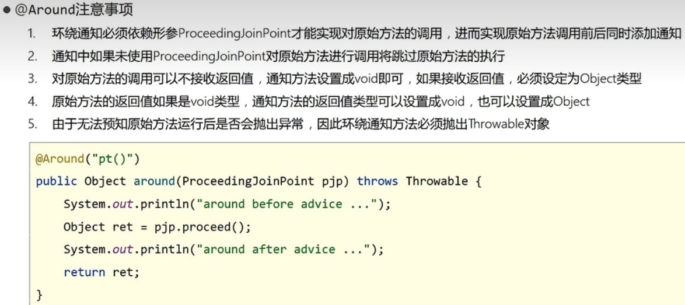
* 其实AOP的通知一共五种类型
  

# 切入点表达式书写技巧及规范

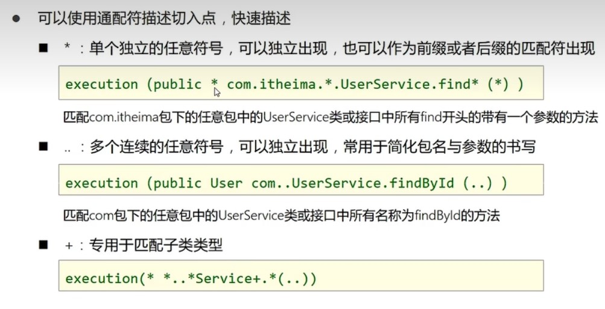
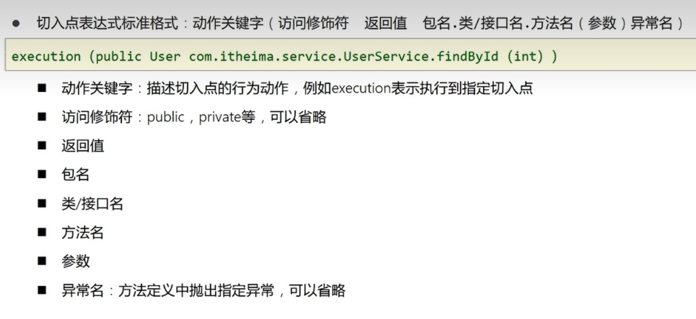
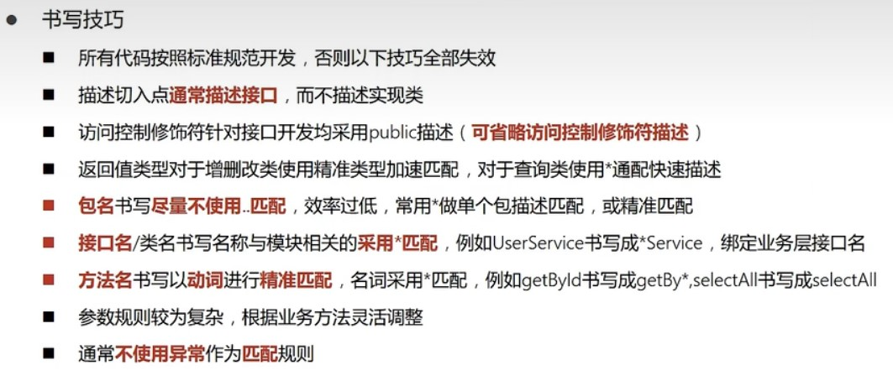

# 关于切入点的信息

> * 通过pjp.getSignature获取切入点的签名对象
> * 通过切入点的签名对象来获取相应的信息

## 获取切入点的类路径、类名、方法名

```
Signature signature = pjp.getSignature();//获取切入点签名
System.out.println("所引用类型为:" + signature.getDeclaringType());
System.out.println("所引用的类为:" + signature.getDeclaringTypeName());
System.out.println("切入点名为:" + signature.getName());
```

* 输出结果如下

```
所引用类型为:interface testAOP.AOPTest
所引用的类为:testAOP.AOPTest
切入点名为:firstMethod
```

## 获取切入点的方法参数

> 当然也可以修改

* 首先修改通知类让它可以匹配任意参数值的方法(就是在方法参数描述那里加两个点)
* 然后通过切入点签名来获取参数(是一个数组)

```java

@Component
@Aspect
public class MyAdvice {
    @Pointcut("execution(void testAOP.AOPTest.*Method(..))")//芝士匹配所有以Method的方法
    private void needMethod() {
    }

    @Around("needMethod()")
    public Object adviceMethod(ProceedingJoinPoint pjp) throws Throwable {
        Signature signature = pjp.getSignature();//获取切入点签名
        System.out.println("切入点名为:" + signature.getDeclaringTypeName() + "." + signature.getName());
        long beginTime = System.currentTimeMillis();
        Object[] args = pjp.getArgs();// 获取方法参数
        args[0] = 890;// 改变参数
        Object obj = pjp.proceed();// 执行方法
        System.out.println("该方法的参数是" + Arrays.toString(args));//输出参数
        Thread.sleep(200);
        long endTime = System.currentTimeMillis();
        long spendTime = endTime - beginTime;
        System.out.println("所耗费的时间为" + spendTime);
        return obj;
    }
}
```

* 接着配置相应的方法让它可以有参数

```
@Override
public void secondMethod(int number) {
    System.out.println("This is a second method,and the param is "+number);
}
```

* 还有测试方法

```
@Test
public void testAOPParam(){
    aopTest.secondMethod(2000);
}
```

* 当然获取参数并非什么都不做，还可以改变它的参数
* 可以在以后通过这种方法来改变错误的传参，或者设置默认的参数
* 可以像这样改变输入的参数`args[0] = 890;// 改变参数`

* 最后输出

```
切入点名为:testAOP.AOPTest.secondMethod
This is a second method,and the param is 2000
该方法的参数是[890]
所耗费的时间为208
```

## 获取切入点的返回值

* 首先改变关于切入点的描述
* 让它可以匹配任意的返回值，注意这里不能省略Public了，或者打两个星
* 然后用AfterReturning注解，注意要设置value的代理方法和returning的参数名
* 通知的形参要与returning的名字一样

```java

@Component
@Aspect
public class MyAdvice {
    @Pointcut("execution(public * testAOP.AOPTest.*Method(..))")//芝士匹配所有以Method的方法
    private void needMethod() {
    }

    @AfterReturning(value = "needMethod()", returning = "obj")
    public void adviceMethod(Object obj) {
        System.out.println("这是返回之后的通知:" + obj);
    }
}
```

* 然后是相应方法

```
@Override
public String thirdMethod() {
    System.out.println("第三个方法");
    return "我要发动一次第三方法";
}
```

* 与测试方法

```
@Test
public void testAOPReturn(){
    String s = aopTest.thirdMethod();
    System.out.println(s);
}
```

* 最后输出

```
第三个方法
这是返回之后的通知:我要发动一次第三方法
我要发动一次第三方法
```

## 关于切入点抛出的异常

* 我们先定义一个一定会抛出异常的方法
* 注意：因为它有返回值，所以要在抛出方法前面加一个永远为真的判断
* 不然编译器会报错，因为return语句永远到达不了

```
@Override
public String fourthMethod() {
    System.out.println("这是第四个方法");
    if (true) throw new NullPointerException();
    return "第四个方法";
    }
```

* 然后通过注解AfterThrowing定义一个抛出异常后的通知方法
* 这个不用注释前面的，事实上前面那个AfterReturning也不用注释之前的

```java

@Component
@Aspect
public class MyAdvice {
    @Pointcut("execution(public * testAOP.AOPTest.*Method(..))")//芝士匹配所有以Method的方法
    private void needMethod() {
    }

    @AfterReturning(value = "needMethod()", returning = "obj")
    public void adviceMethod(Object obj) {
        System.out.println("这是返回之后的通知:" + obj);
    }

    @AfterThrowing(value = "needMethod()", throwing = "e")
    public void adviceMethod03(Throwable e) {
        System.out.println("这是它抛出的异常" + e);
    }
}
```

* 这是输出
* 后面还跟着与异常相应的一大堆报错

```
这是第四个方法
这是它抛出的异常java.lang.NullPointerException
```

## 还有其它的方式

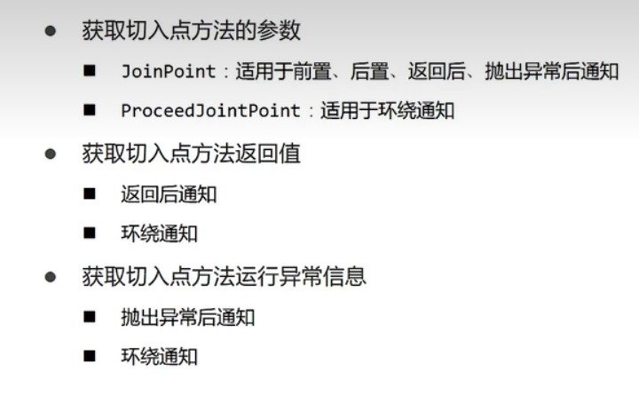
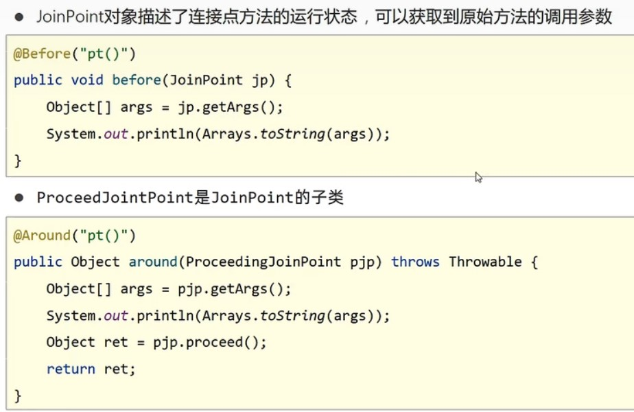
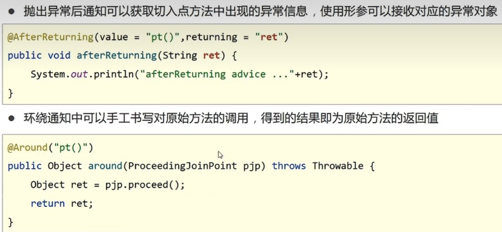
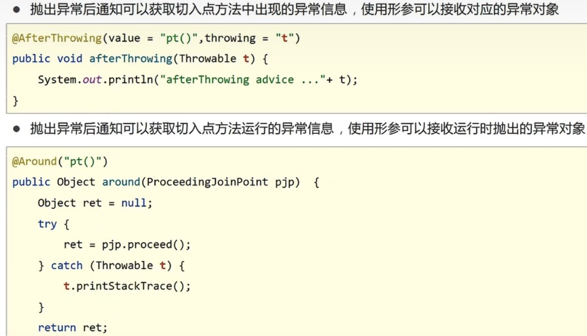

# 案例:验证密码

> * 当然不会真的验证
> * 百度网盘的密钥是跟URL绑定的，两个一起验证
> * 这个逻辑是展示通过spring验证密钥是否正确

* 两个接口不言而喻
* Dao接口的实现类

```java

@Repository
public class ResourcesDaoImpl implements ResourcesDao {
    @Override
    public boolean readResources(String url, String password) {
        System.out.println(password.length());
        //模拟校验
        return password.equals("root");
    }
}
```

* Service接口实现类

```java

@Service
public class ResourcesServiceImpl implements ResourcesService {
    @Autowired
    private ResourcesDao resourcesDao;

    @Override
    public boolean openURL(String url, String password) {
        return resourcesDao.readResources(url, password);
    }
}
```

* 通知类
* 注意里面的判断参数是不是字符串的代码

```java

@Component
@Aspect
public class DataAdvice {
    @Pointcut("execution(boolean baiduCheck.*Service.*(*,*))")
    private void servicePt() {
    }

    @Around("DataAdvice.servicePt()")
    public Object trimStr(ProceedingJoinPoint pjp) throws Throwable {
        Object[] args = pjp.getArgs();
        for (int i = 0; i < args.length; i++) {
            //判断参数是不是字符串
            if (args[i].getClass().equals(String.class)) {
                args[i] = args[i].toString().trim();
            }
        }
        return pjp.proceed(args);
    }
}
```

* 测试方法

```
@Test
public void baiduCheck(){
    ApplicationContext ctx = new AnnotationConfigApplicationContext(SpringConfig.class);
    ResourcesService resourcesService = ctx.getBean(ResourcesService.class);
    boolean flag = resourcesService.openURL("https://pan.baidu.com/haha", "root ");
    System.out.println(flag);
}
```

# AOP总结

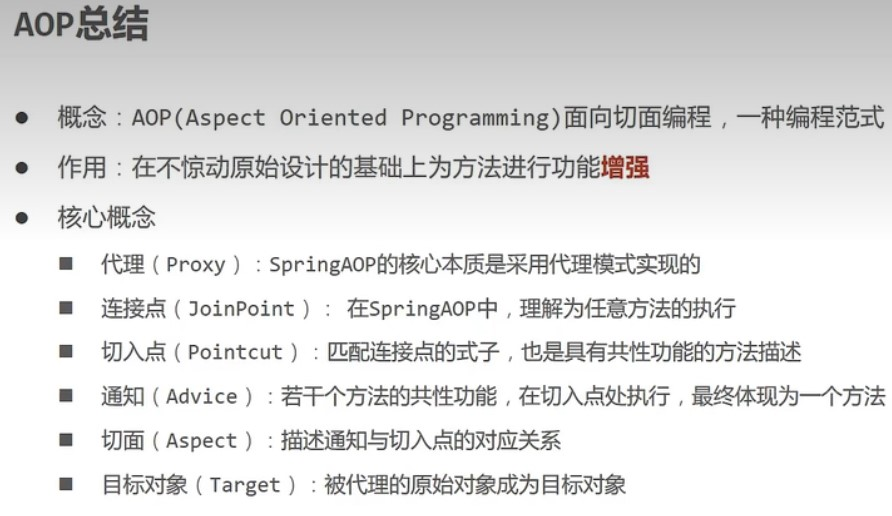
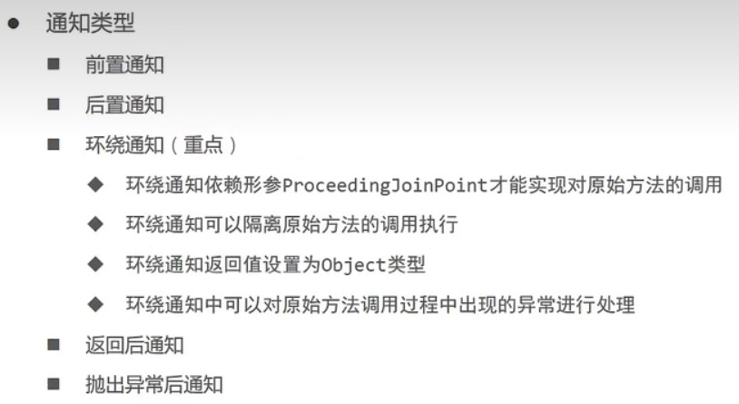
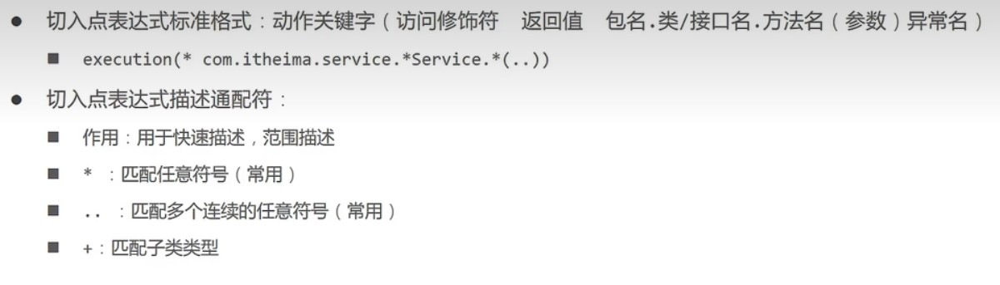
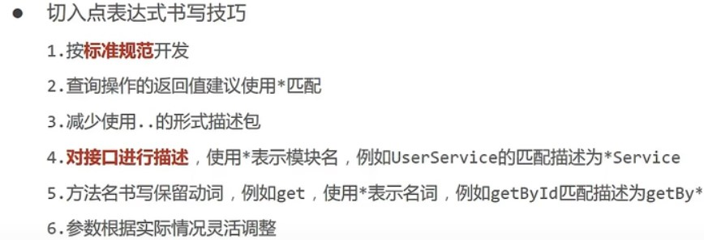
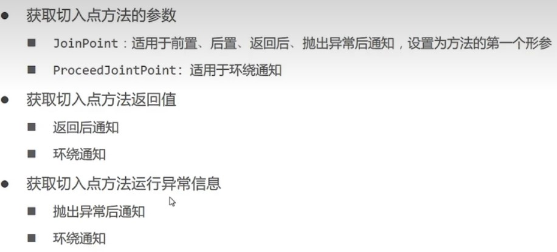