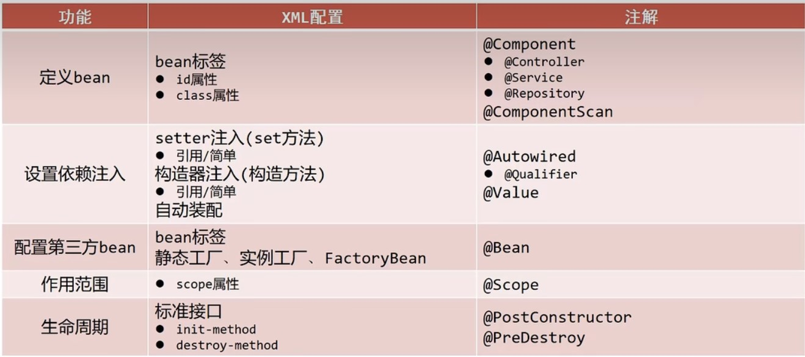

# 注解开发

## 注解开发初入手

* 在类上写Component注解
* Component分了三个衍生注解
    * Controller:表现层bean
    * Service:业务层bean
    * Repository:数据层bean
* 注解里面的别名可以不写，到时候会按照类型来自动装配

```java

@Service("bookServiceImpl")
public class BookServiceImpl implements BookService {
    public BookServiceImpl() {
        System.out.println("hhhhhhhhhhh");
    }

    @Override
    public void deposit() {
        System.out.println("You are saving a book");
    }
}
```

* 在配置文件中如此定义(这个扫描包在context命名空间，不能改)
* 这个可以被另外一种方式(配置类)替代

```html
<?xml version="1.0" encoding="UTF-8"?>
<beans xmlns="http://www.springframework.org/schema/beans"
       xmlns:xsi="http://www.w3.org/2001/XMLSchema-instance"
       xmlns:context="http://www.springframework.org/schema/context"
       xsi:schemaLocation="http://www.springframework.org/schema/beans
       http://www.springframework.org/schema/beans/spring-beans.xsd
       http://www.springframework.org/schema/context
       http://www.springframework.org/schema/context/spring-context.xsd
">
    <context:component-scan base-package="dao service"/>
</beans>
```

* 通过配置类来彻底干掉配置文件
* 创建一个配置类
* `@Configuration`声明配置类
* `@ComponentScan`定义包扫描路径

```java

@Configuration
@ComponentScan({"dao", "service"})
public class myConfig.SpringConfig {
}
```

* 接着把加载配置文件的语句换成

```
ApplicationContext acx=new AnnotationConfigApplicationContext(myConfig.SpringConfig.class);
```

* 然后就可以将配置文件删除了
* 使用这种方法默认延迟加载

## bean管理

> * 关于注解开发，怎么管理作用域以及生命周期
> * 管理作用域:`@Scope("prototype")`或者`@Scope("singleton")`
> * 生命周期`@PostConstruct`(在构造方法后)初始化，`@PreDestroy`(在销毁之前)销毁方法
> * 注意的是,关于生命周期的这两个注解在jdk9中被弃用，在jdk11中被删除
> * 现在使用需要引入一个包

```html

<dependency>
    <groupId>javax.annotation</groupId>
    <artifactId>javax.annotation-api</artifactId>
    <version>1.3.2</version>
</dependency>
```

* 代码示例如下

```java

@Service()
@Scope("singleton")
public class BookServiceImpl implements BookService {
    public BookServiceImpl() {
        System.out.println("hhhhhhhhhhh");
    }

    @Override
    public void deposit() {
        System.out.println("You are saving a book");
    }

    @PostConstruct
    public void init() {
        System.out.println("这是在构造方法之后");
    }

    @PreDestroy
    public void destroy() {
        System.out.println("只有单例作用域才会执行销毁方法");
        System.out.println("这是在调用关闭钩子后，在销毁之前");
    }
}
```

```
public void testIoC() {
    AnnotationConfigApplicationContext acx = new AnnotationConfigApplicationContext(myConfig.SpringConfig.class);
    BookService bookService = acx.getBean(BookService.class);
    BookService bookService01 = acx.getBean(BookService.class);
    System.out.println(bookService01);
    System.out.println(bookService);
    bookService.deposit();
    acx.close();
}
```

## 依赖注入

* 自动装配，像这样
* 是通过暴力反射进行注入，所以可以不用setter方法

```
@Autowired
private BookDao bookDao;
```

* 也可以指定名字

```
@Autowired
@Qualifier("bookDaoImpl")
private BookDao bookDao;
```

* 注解除了放在值上面，也可以放在set方法上面，但是set方法被我干掉了
* 通过value注解来设置简单类型的值

```
@Value("zhangSan")
private String bookName;
@Value("900")
private int bookPrice;
```

* 这个value可以去引入配置文件里的参数
* 操作流程如下
* 先将`myConfig.SpringConfig.java`提出来，放在java文件夹下，
* 这是为了好好解析resources文件夹里的文件，不然idea会警告(虽然照样用就是了)
* 通过`@PropertySource`注解，加入读取的`properties`文件名
* 在`properties`文件中写键值对
* 在实现类的相应value中，使用占位符

流程展示

* myConfig.SpringConfig.java

```java

@Configuration
@ComponentScan({"dao", "service"})
@PropertySource("mySelf.properties")
public class myConfig.SpringConfig {
}
```

* mySelf.properties

```
myBookName=OceanCity
myMoney=800
```

* BookDaoImpl.java

```java

@Repository("bookDaoImpl")
public class BookDaoImpl implements BookDao {
    @Value("${myBookName}")
    private String bookName;
    @Value("${myMoney}")
    private int bookPrice;

    @Override
    public void store() {
        System.out.println("The book is stored on the shelf");
        System.out.println(bookName + ":" + bookPrice);
    }
}
```

## 通过注解给第三方bean赋值

* 直接写在配置类里
* 通过bean注解进行声明

```java

@Configuration
@ComponentScan({"dao", "service"})
@PropertySource("mySelf.properties")
public class myConfig.SpringConfig {

    @Bean
    public DataSource dataSource() {
        DruidDataSource dds = new DruidDataSource();
        dds.setDriverClassName("com.mysql.jdbc.Driver");
        dds.setUrl("jdbc:mysql://localhost:3306/spring_db");
        dds.setUsername("root");
        dds.setPassword("root");
        return dds;
    }
}
```

* 还有一种方法
* 另外开一个配置类(可以放在其他文件夹)，在里面写配置
* 然后在主配置类里通过import注解导入
* 注意:import注解只能有一个，如果想导多个其他配置类，需要通过数组的形式导入
* 另外，bean下的形参会通过类型进行自动装配

```java

@Configuration
public class JdbcConfig {
    //1.定义一个方法获得要管理的对象
    @Value("com.mysql.jdbc.Driver")
    private String driver;
    @Value("jdbc:mysql://localhost:3306/spring_db")
    private String url;
    @Value("root")
    private String userName;
    @Value("root")
    private String password;

    //2.添加@Bean，表示当前方法的返回值是一个bean
    //@Bean修饰的方法，形参根据类型自动装配
    @Bean
    public DataSource dataSource(BookDao bookDao) {
        System.out.println(bookDao);
        DruidDataSource ds = new DruidDataSource();
        ds.setDriverClassName(driver);
        ds.setUrl(url);
        ds.setUsername(userName);
        ds.setPassword(password);
        return ds;
    }
}

```

* 在主配置类中通过Import注解导入

```java

@Configuration
@ComponentScan({"dao", "service"})
@PropertySource("mySelf.properties")
@Import(JdbcConfig.class)
public class myConfig.SpringConfig {
}
```

## XML与注解的区别

* 