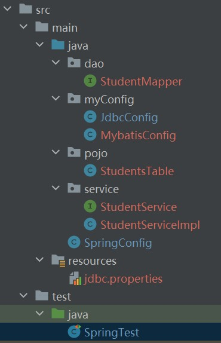

# Spring整合Mybatis

* 先导入坐标

```html

<dependencies>
    <dependency>
        <groupId>org.springframework</groupId>
        <artifactId>spring-context</artifactId>
        <version>5.3.23</version>
    </dependency>
    <dependency>
        <groupId>com.alibaba</groupId>
        <artifactId>druid</artifactId>
        <version>1.2.13-SNSAPSHOT</version>
    </dependency>
    <dependency>
        <groupId>org.mybatis</groupId>
        <artifactId>mybatis</artifactId>
        <version>3.5.10</version>
    </dependency>
    <dependency>
        <groupId>mysql</groupId>
        <artifactId>mysql-connector-java</artifactId>
        <version>8.0.30</version>
    </dependency>
    <dependency>
        <groupId>org.springframework</groupId>
        <artifactId>spring-jdbc</artifactId>
        <version>5.3.23</version>
    </dependency>
    <dependency>
        <groupId>org.mybatis</groupId>
        <artifactId>mybatis-spring</artifactId>
        <version>2.0.7</version>
    </dependency>
    <dependency>
        <groupId>junit</groupId>
        <artifactId>junit</artifactId>
        <version>4.13.2</version>
        <scope>test</scope>
    </dependency>
    <dependency>
        <groupId>org.springframework</groupId>
        <artifactId>spring-test</artifactId>
        <version>5.3.23</version>
    </dependency>
</dependencies>
```

* 然后在resources文件夹下建立jdbc.properties
* 注意driver的导包，比较高级的mysql是这种方式

```html
jdbc.driver=com.mysql.cj.jdbc.Driver
jdbc.url=jdbc:mysql://localhost:3306/shixun0515?useSSL=true
jdbc.username=root
jdbc.password=root
```

* 接着在myConfig文件夹下建立JdbcConfig.java

```java
public class JdbcConfig {
    @Value("${jdbc.driver}")
    private String driver;
    @Value("${jdbc.url}")
    private String url;
    @Value("${jdbc.username}")
    private String userName;
    @Value("${jdbc.password}")
    private String password;

    @Bean
    public DataSource dataSource() {
        DruidDataSource ds = new DruidDataSource();
        ds.setDriverClassName(driver);
        ds.setUrl(url);
        ds.setUsername(userName);
        ds.setPassword(password);
        return ds;
    }
}
```

* 再写一个Mybatis配置类
* 上面的是实体类的包所在
* 下面的是mapper接口的包所在

```java
public class MybatisConfig {
    //定义bean，SqlSessionFactoryBean，用于产生SqlSessionFactory对象
    @Bean
    public SqlSessionFactoryBean sqlSessionFactory(DataSource dataSource) {
        SqlSessionFactoryBean ssfb = new SqlSessionFactoryBean();
        ssfb.setTypeAliasesPackage("pojo");
        ssfb.setDataSource(dataSource);
        return ssfb;
    }

    //定义bean，返回MapperScannerConfigurer对象
    @Bean
    public MapperScannerConfigurer mapperScannerConfigurer() {
        MapperScannerConfigurer msc = new MapperScannerConfigurer();
        msc.setBasePackage("dao");
        return msc;
    }
}
```

* 然后在总配置进行导入

```java

@Configuration
@ComponentScan({"service", "dao"})
@PropertySource("classpath:jdbc.properties")
@Import({JdbcConfig.class, MybatisConfig.class})
public class SpringConfig {
}
```

* 在dao文件夹下写映射文件
* 记得加个注解防止报错，虽然报错也能用

```java

@Repository
public interface StudentMapper {
    @Select("select * from students")
    List<StudentsTable> selectAll();
}
```

* 在pojo写个实体类,这个类前面用过的
* 在service下面定义一个接口，主要是为了通过接口调用

```java
public interface StudentService {
    List<StudentsTable> selectAll();
}
```

* 然后实现接口，注意返回值类型
* 这里的自动装配，如果mapper接口没有加注解会报错,但能用

```java

@Service
public class StudentServiceImpl implements StudentService {

    @Autowired
    private StudentMapper studentMapper;

    @Override
    public List<StudentsTable> selectAll() {
        return studentMapper.selectAll();
    }
}
```

* 最后进行测试

```
@Test
public void testMybatis(){
    AnnotationConfigApplicationContext acx = new AnnotationConfigApplicationContext(SpringConfig.class);
    StudentService service=acx.getBean(StudentService.class);
    List<StudentsTable> studentsTables=service.selectAll();
    for (StudentsTable studentsTable:studentsTables){
        System.out.println(studentsTable);
    }
}
```

* 文件夹整体是这样的



# 整合Junit

* 先导入坐标(前面已经导入过)

```html

<dependency>
    <groupId>junit</groupId>
    <artifactId>junit</artifactId>
    <version>4.13.2</version>
    <scope>test</scope>
</dependency>
<dependency>
    <groupId>org.springframework</groupId>
    <artifactId>spring-test</artifactId>
    <version>5.3.23</version>
</dependency>
```

* 再写一个测试类
* 注意开头两个注解(第二个导入自己的配置类)

```java

@RunWith(SpringJUnit4ClassRunner.class)
@ContextConfiguration(classes = SpringConfig.class)
public class SpringTest {
    @Autowired
    private StudentService service;

    @Test
    public void testMybatis() {
        List<StudentsTable> studentsTables = service.selectAll();
        for (StudentsTable studentsTable : studentsTables) {
            System.out.println(studentsTable);
        }
    }
}
```