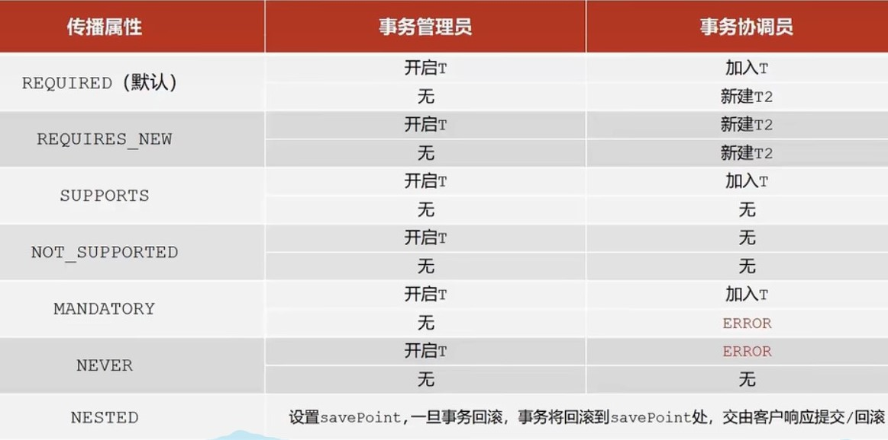

# Spring事务

> * Spring可以通过注解进行事务管理
> * 事务管理员：发起事务方，在Spring中通常指代业务层开启事务的方法
> * 事务协调员：加入事务方，在Spring中通常指代数据层方法，也可以是业务层方法

- 事务作用：在数据层保障一系列的数据库操作同成功同失败
- Spring事务作用：在数据层或**==业务层==**保障一系列的数据库操作同成功同失败

##### 知识点1：@EnableTransactionManagement

| 名称    | @EnableTransactionManagement |
|:------|:-----------------------------|
| 类型    | 配置类注解                        |
| 位置    | 配置类定义上方                      |
| 作用    | 设置当前Spring环境中开启注解式事务支持       |

##### 知识点2：@Transactional

| 名称    | @Transactional                           |
|:------|:-----------------------------------------|
| 类型    | 接口注解  类注解  方法注解                          |
| 位置    | 业务层接口上方  业务层实现类上方  业务方法上方                |
| 作用    | 为当前业务层方法添加事务（如果设置在类或接口上方则类或接口中所有方法均添加事务） |

## 开始上手

* jdbc.properties
* 很正常

```
jdbc.driver=com.mysql.cj.jdbc.Driver
jdbc.url=jdbc:mysql://localhost:3306/shixun0515?useSSL=true
jdbc.username=root
jdbc.password=root
```

* JdbcConfig.java
* 新设置了事务管理器`PlatformTransactionManager`
* 事务管理器要根据使用技术进行选择，Mybatis框架使用的是JDBC事务，可以直接使用`DataSourceTransactionManager`
* 目前的事务管理是基于`DataSourceTransactionManager`和`SqlSessionFactoryBean`使用的是同一个数据源。

```java
public class JdbcConfig {
    @Value("${jdbc.driver}")
    private String driver;
    @Value("${jdbc.url}")
    private String url;
    @Value("${jdbc.username}")
    private String userName;
    @Value("${jdbc.password}")
    private String password;

    @Bean
    public DataSource dataSource() {
        DruidDataSource ds = new DruidDataSource();
        ds.setDriverClassName(driver);
        ds.setUrl(url);
        ds.setUsername(userName);
        ds.setPassword(password);
        return ds;
    }

    @Bean//配置事务管理器，mybatis使用的是jdbc事务
    public PlatformTransactionManager transactionManager(DataSource dataSource) {
        DataSourceTransactionManager transactionManager = new DataSourceTransactionManager();
        transactionManager.setDataSource(dataSource);
        return transactionManager;
    }
}
```

* MybatisConfig.java
* 很正常

```java
public class MybatisConfig {
    //定义bean，SqlSessionFactoryBean，用于产生SqlSessionFactory对象
    @Bean
    public SqlSessionFactoryBean sqlSessionFactory(DataSource dataSource) {
        SqlSessionFactoryBean ssfb = new SqlSessionFactoryBean();
        ssfb.setTypeAliasesPackage("pojo");
        ssfb.setDataSource(dataSource);
        return ssfb;
    }

    //定义bean，返回MapperScannerConfigurer对象
    @Bean
    public MapperScannerConfigurer mapperScannerConfigurer() {
        MapperScannerConfigurer msc = new MapperScannerConfigurer();
        msc.setBasePackage("dao");
        return msc;
    }
}
```

* SpringConfig.java
* 通过EnableTransactionManagement注解来开启事务

```java

@Configuration
@ComponentScan({"service", "dao", "testAOP", "baiduCheck"})
@EnableAspectJAutoProxy
@PropertySource("classpath:jdbc.properties")
@Import({JdbcConfig.class, MybatisConfig.class})
@EnableTransactionManagement//开启注解式事务驱动
public class SpringConfig {
}
```

* 接着开始实现
* 首先定义接口AccountDao.java
* 这里的add,reduce方法扮演着事务协调员(加入事务)

```java

@Repository
public interface AccountDao {
    @Update("update societys set account = account + #{account} where societyName = #{name}")
    void add(@Param("account") Double money, @Param("name") String name);

    @Update("update societys set account = account - #{account} where societyName = #{name}")
    void reduce(@Param("account") Double money, @Param("name") String name);
}
```

* 再定义Service接口AccountService.java
* 这里面的transfer方法扮演的是事务管理员(开启事务)
* ---
* @Transactional可以写在接口类上、接口方法上、实现类上和实现类方法上
* 写在接口类上，该接口的所有实现类的所有方法都会有事务
* 写在接口方法上，该接口的所有实现类的该方法都会有事务
* 写在实现类上，该类中的所有方法都会有事务
* 写在实现类方法上，该方法上有事务
* 一般写在接口上，降低耦合

```java
public interface AccountService {
    /**
     * 转账操作
     * @param out 传出方
     * @param in 转入方
     * @param money 金额
     */
    //配置当前接口方法具有事务
    @Transactional
    void transfer(String out, String in, Double money);
}
```

* 然后实现它
* AccountServiceImpl.java

```java

@Service
public class AccountServiceImpl implements AccountService {
    @Autowired
    private AccountDao accountDao;

    @Override
    public void transfer(String out, String in, Double money) {
        accountDao.reduce(money, out);
//        int i=9/0;
        accountDao.add(money, in);
    }
}
```

* 最后测试方法

```
@Autowired
private AccountService accountService;

@Test
public void testTransfer(){
    accountService.transfer("黄金之风","轻音部",100D);
}
```

## 添加转账日志

> * 在数据库定义一个日志表
> * 这个日志要能记录每次操作，无论成功或失败
> * 这里是事务传播的知识

* 首先建一个表

```sql
DROP TABLE IF EXISTS account_log;
create table account_log
(
    id         int primary key auto_increment,
    info       varchar(255),
    createDate datetime
)
```

* 再定义一个接口

```java

@Repository
public interface LogDao {
    @Insert("insert into account_log (info,createDate) values(#{info},now())")
    void log(String info);
}
```

* 再定义一个接口及它实现类

```java
public interface LogService {
    void log(String out, String in, Double money);
}
```

* 实现类
* 这次Transactional设置在实现类

```java

@Service
public class LogServiceImpl implements LogService {
    @Autowired
    private LogDao logDao;

    @Transactional
    public void log(String out, String in, Double money) {
        logDao.log("转账操作由" + out + "到" + in + ",金额：" + money);
    }
}
```

* 接着使用try-finally结构把日志方法放进去

```java

@Service
public class AccountServiceImpl implements AccountService {
    @Autowired
    private AccountDao accountDao;
    @Autowired
    private LogService logService;

    @Override
    public void transfer(String out, String in, Double money) {
        // 存在结构try-finally
        try {
            accountDao.reduce(money, out);
//        int i=9/0;
            accountDao.add(money, in);
        } finally {
            logService.log(out, in, money);
        }
    }
}
```

* 其他方法不变(包括测试方法)

## 事务传播

> * 上面的操作定义了一个插入日志的操作
> * 我们要无论成功失败都要插入，但是很明显失败没有插入
> * 这就是事务传播，三个事务协调被加入了事务管理之中，然后失败就一起回滚
> * 似乎无视了try-finally
> * 需要用到事务传播行为
> * 事务传播行为：事务协调员对事务管理员所携带事务的处理态度`propagation属性`。

* 在Transactional里面设置propagation = Propagation.REQUIRES_NEW
* 表示传播行为设置为当前操作需要新事务
* 这样就行

```java

@Service
public class LogServiceImpl implements LogService {
    @Autowired
    private LogDao logDao;

    @Transactional(propagation = Propagation.REQUIRES_NEW)
    public void log(String out, String in, Double money) {
        logDao.log("转账操作由" + out + "到" + in + ",金额：" + money);
    }
}
```

## 属性设置说明

