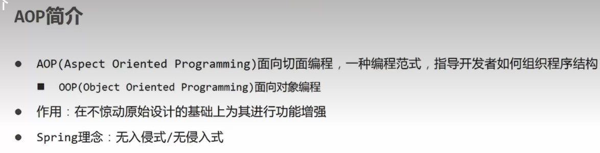
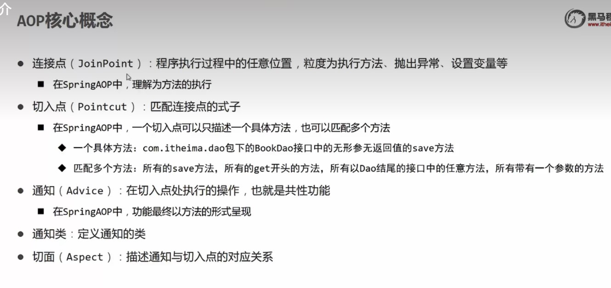
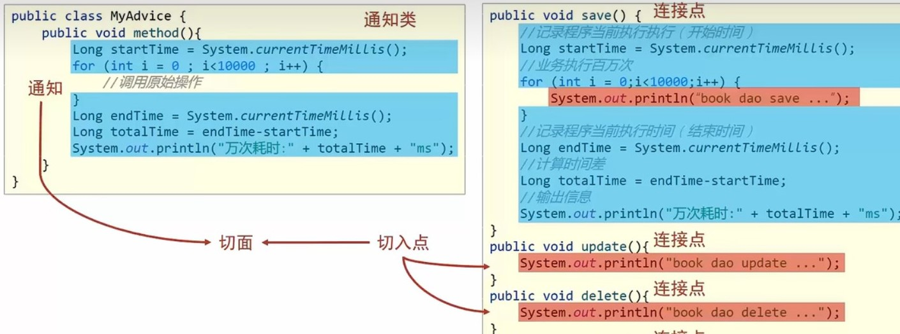
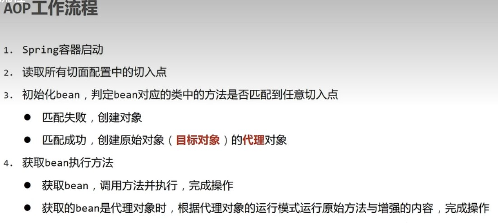
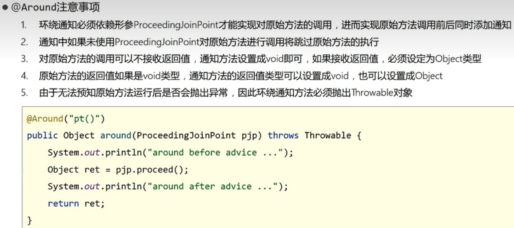
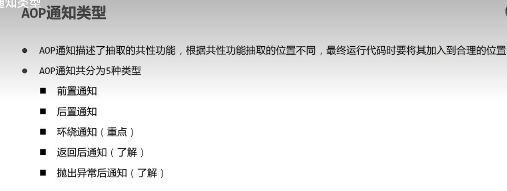
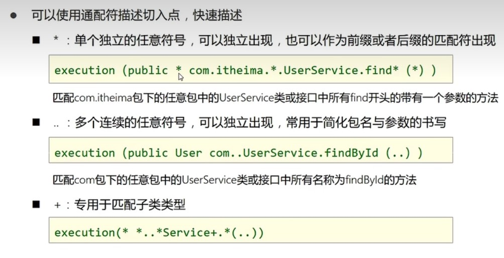
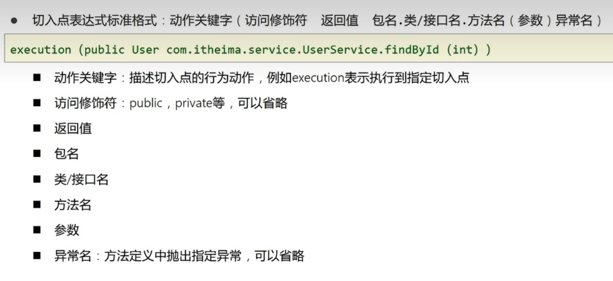
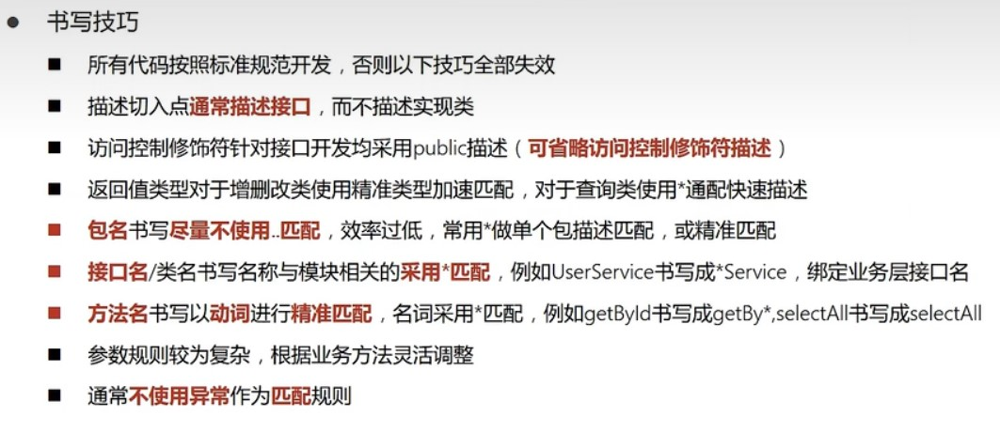

# 关于AOP编程

> * SpringAOP本质是代理模式
> * AOP核心概念有两个:目标对象和代理

## AOP概念






## 上手

* 先在pom.xml导入坐标

```html

<dependency>
    <groupId>org.aspectj</groupId>
    <artifactId>aspectjweaver</artifactId>
    <version>1.9.9.1</version>
</dependency>
```

* 再定义一个接口和它的实现类
* 这个两个类很正常，毕竟AOP主打的就是无侵入式
* AOPTest.java

```java
public interface AOPTest {
    void firstMethod();

    void secondMethod();

    void thirdMethod();
}
```

* AOPTestImpl.java

```java

@Component
public class AOPTestImpl implements AOPTest {
    @Override
    public void firstMethod() {
        System.out.println("这是第一个方法");
    }

    @Override
    public void secondMethod() {
        System.out.println("This is a second method");
    }

    @Override
    public void thirdMethod() {
        System.out.println("第三个方法");
    }
}
```

* 再定义一个通知类，用于实现AOP
* Component声明bean,Aspect声明这是一个通知类
* Pointcut写所实现方法的全路径，下面跟一个private的空方法
* Before表示在切入方法之前执行,也可以用其他注解，比如Around表示把切入方法放在通知方法里面
* MyAdvice.java

```java

@Component
@Aspect
public class MyAdvice {
    @Pointcut("execution(void testAOP.AOPTest.firstMethod())")
    private void needMethod() {
    }

    @Before("needMethod()")
    public void adviceMethod() {
        System.out.println("这是切片");
        System.out.println(System.currentTimeMillis());
    }
}
```

* 接着在配置类中进行导入
* 注意:新增了注解`@EnableAspectJAutoProxy`
* 作用是向spring声明所扫描的bean中存在通知类
* 其他的都是上一个实验的

```java

@Configuration
@ComponentScan({"service", "dao", "testAOP"})
@EnableAspectJAutoProxy
@PropertySource("classpath:jdbc.properties")
@Import({JdbcConfig.class, MybatisConfig.class})
public class SpringConfig {
}
```

# 关于around的注解

* 把配置类这样改就行，完全就是大改
* 因为这位注解有严格的格式
* 这个格式给其他的注解通用

```java

@Component
@Aspect
public class MyAdvice {
    @Pointcut("execution(void testAOP.AOPTest.*Method())")//芝士匹配所有以Method的方法
    private void needMethod() {
    }

    @Around("needMethod()")
    public Object adviceMethod(ProceedingJoinPoint pjp) throws Throwable {
        System.out.println("这是切片");
        long beginTime = System.currentTimeMillis();
        Object obj = pjp.proceed();
        Thread.sleep(200);
        long endTime = System.currentTimeMillis();
        long spendTime = endTime - beginTime;
        System.out.println("所耗费的时间为" + spendTime);
        return obj;
    }
}
```
* 注意事项

* 其实AOP的通知一共五种类型


# 切入点表达式书写技巧及规范


